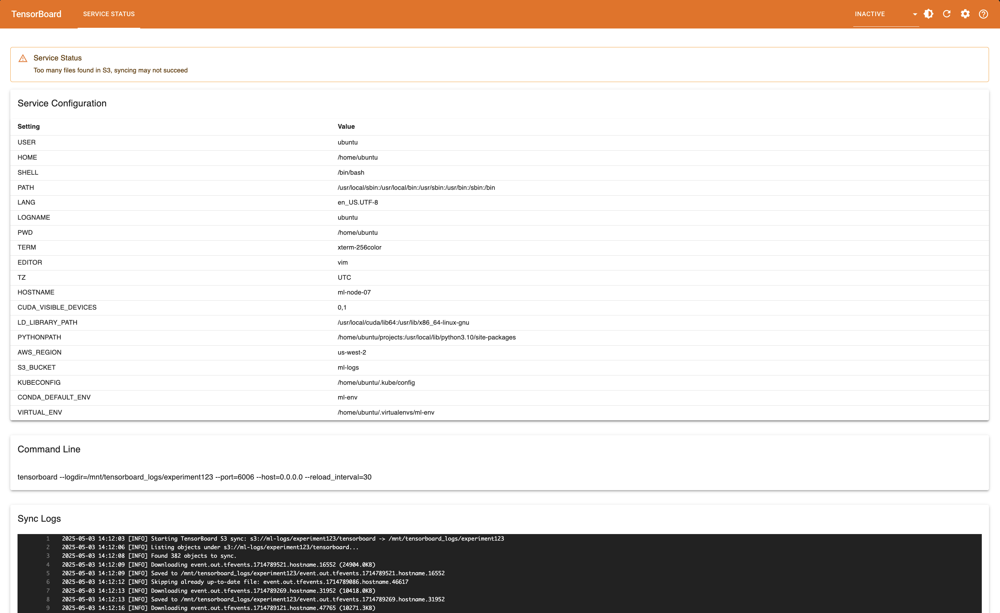

# how it looks

# once:
`uv venv && source .venv/bin/activate && uv pip install -e . && npm install`

# build and run
`npx webpack && uv pip install -e . && uv run tensorboard --logdir . --load_fast=false`